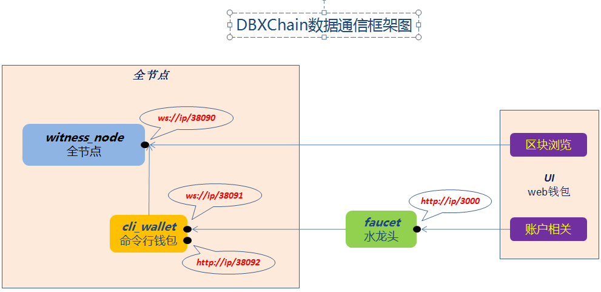

# DBXChain构成

DBXChain主要有`dbxchain`、`dbxui`、`dbxfaucet`三大部分组成：

* [<b>dbxchain</b>](dbxchain_introduction.md)

DBXChain公链，基于石墨烯技术，基于C++开发。

dbxchain主要由`witness_node`和`cli_wallet`程序组成。

`witness_node` 通过 P2P 方式连接到DBXChain网络，从网络接收最新区块，向网络广播本地签署的交易包。

`cli_wallet` 通过 websocket 方式连接到 witness_node， 管理钱包文件； 提供交易签名功能，签名后通过 witness_node 向外广播； 通过 http rpc 的方式提供 API 供其他程序调用。

数据同步接入点地址  
主网: <b>`ws://sync.dbxchain.io`</b> 
测试网: <b>`ws://sync.testnet.dbxchain.io`</b>

客户端服务接入点地址  
主网: <b>`ws://client.dbxchain.io`</b> 
测试网: <b>`ws://client.testnet.dbxchain.io`</b>

* [<b>dbxui</b>](dbxui_introduction.md) 

web在线钱包，区块浏览器，同时也是在线的钱包。web形式的浏览器客户端，基于Nodejs开发。

在线钱包地址  
主网: <b> http://wallet.dbxchain.io</b>  
测试网: <b> http://wallet.testnet.dbxchain.io</b>

* [<b>dbxfaucet</b>](dbxfaucet_introduction.md) 

水龙头，用于web钱包客户端连接，继续宁账户注册服务，基于ruby开发。

水龙头地址  
主网: <b> https://wallet.mainnet.dbxchain.io/account/register</b>  
测试网: <b> https://wallet.testnet.dbxchain.io/account/register</b>

# DBXChain网络模型

# 技术要点
* [编译安装](compile.md)
* [witness_node参数介绍](cmd/witness_node.md)
* [witness_node api 介绍](api/witness_node.md)
* [cli_wallet参数介绍](cmd/cli_wallet.md)
* [cli_wallet api 介绍](api/cli_wallet.md)
* [同步节点](sync.md)
* [账户注册](register.md)
* [搭建私链](private-chain.md)