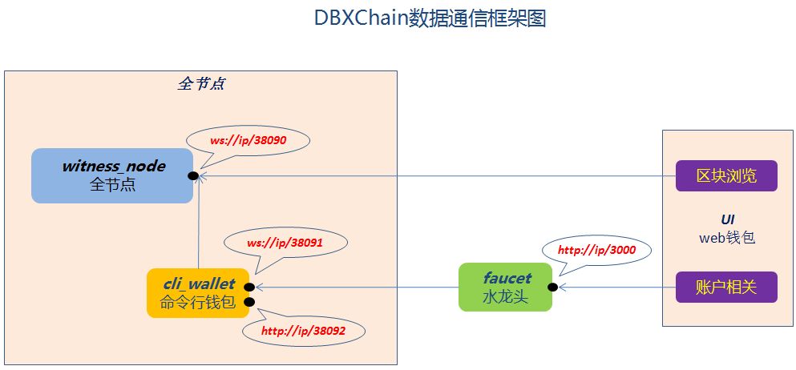

# DBXChain api calling logic


From the picture, DBXChain is primarily composed of `dbxchain`、`dbxui`、`dbxfaucet` three parts, we will not focus on the basic introduction of these parts here, please refer to [DBXChain composition](../../introduction.md) for more details.

From the picture, there are two basic api calling logics, namely `block browsing` and `account operation`.

- As to calling `block browsing` related functionality, directly access the api interface of witness_node.
- As to calling `account operation` related functionality, you need to access the api interface of the faucet；the faucet then accesses the api interface of cli_wallet, cli_wallet finally calls the api interface of witness_node. Please note the account registration in DBXChain system could be done by `Lifelong account`(please refer to [Establish private chain](../private-chain.md) for details ), one `Lifelong account` on the chain has been loaded to cli_wallet, therefore could provide account registrating service for faucet and web wallet. In addition, when registrating an account, it provides some commission for the new account.


Thus, we can divide api into three types, namely `Chain api` of the witness_node, `Wallet api` of the cli_wallet and `Faucet api` of the faucet.

# Generation of the api service interface

## Chain api
The generatioin of chain api could  set in the parameters when the witness_node service is initiating, as well as in the chain configuration file `config.ini`, however the initiating parameter of witness_node has higher priority. Please refer to [witness_node parameter introduction](../cmd/witness_node.md) for more details

Please refer to [Wallet api](../api/witness_node.md) for accessing the chain api.

## Wallet api
The generation of chain api is set in the parameters when the cli_wallet service is initiating. Please refer to [cli_wallet parameter introduction](../cmd/cli_wallet.md) for more details.

```
cli_wallet -w wallet.json -s ws://127.0.0.1:38090 -r 127.0.0.1:38091 -H 127.0.0.1:38092 --chain-id 6e340b9cffb37a989ca544e6bb780a2c78901d3fb33738768511a30617afa01d
```

* `-r 127.0.0.1:38091` provides wallet rpc api service to the public, including jsonrpc and websocket service.
* `-H 127.0.0.1:38092` provides http jsonrpc api service.

Please refer to [Wallet api](../api/cli_wallet.md) for accessing the wallet api.

## Faucet api
The generation of faucet api is set in the faucet configuration file.

Please refer to [Faucet api](../api/faucet.md) for accessing the faucet api.
